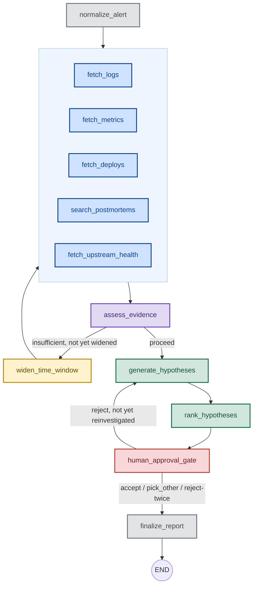

# TriageGraph

An agentic incident-triage copilot built on [LangGraph](https://langchain-ai.github.io/langgraph/). Give it an alert and it fans out across metrics, logs, recent deploys, upstream service health, and past postmortems, reasons over all five with an LLM, and produces a ranked, evidence-cited root-cause hypothesis tree — pausing for a human's sign-off before anything is treated as "actioned." It currently runs entirely on localhost against scenario-driven synthetic data (no real Prometheus/Splunk/GitHub account needed), with the data layer built behind abstract interfaces specifically so real credentials can be dropped in later.

This document is meant to be sufficient on its own: architecture, why it's built the way it is, how to run and test it, and what to watch out for. It does not track development history — read the git log for that.

---

## Quickstart

```bash
python3 -m venv .venv && source .venv/bin/activate
pip install -r requirements.txt
cp .env.example .env          # fill in OPENAI_API_KEY (or ANTHROPIC_API_KEY + LLM_PROVIDER=anthropic)

python main.py --scenario kafka_consumer_lag_deploy          # interactive: prompts you at the approval gate
python main.py --scenario kafka_consumer_lag_deploy --auto-approve --out report.md
python -m scripts.eval_scenarios                              # runs all 4 golden scenarios, prints an accuracy table
```

No API key is needed to explore evidence-gathering alone — every node up through `assess_evidence`/`widen_time_window` is rule-based. A key is only required once execution reaches `generate_hypotheses` (see [Architecture](#architecture)).

---

## Architecture

### The graph



Color = what kind of action the node performs, not which milestone added it:

| Color | Action | Nodes |
|---|---|---|
| ⚪ gray | Ingest / output — parse in, render out | `normalize_alert`, `finalize_report` |
| 🔵 blue | Gather — rule-based fetch from one evidence source | `fetch_metrics`, `fetch_logs`, `fetch_deploys`, `search_postmortems`, `fetch_upstream_health` |
| 🟣 purple | Decide — rule-based check that picks a branch | `assess_evidence` |
| 🟠 amber | Redirect — widens scope and retries, capped at once | `widen_time_window` |
| 🟢 green | Reason — an actual LLM call | `generate_hypotheses`, `rank_hypotheses` |
| 🔴 red | Human gate — execution pauses for a person | `human_approval_gate` |

The five fetch nodes are grouped in the unlabeled blue box above — they run in parallel, all fed by `normalize_alert` (or `widen_time_window` on the retry loop), and all fan back into `assess_evidence`. They're drawn as one visual group rather than ten separate crossing arrows purely for legibility; in the actual graph each of the five has its own independent edge in both directions (see `graph/build_graph.py`).

The topology is fixed and known ahead of time — every edge above is decided at build time, not delegated to an agent to figure out at runtime. That's the main reason this is a LangGraph `StateGraph` rather than a multi-agent framework like CrewAI: CrewAI earns its keep when *who does what next* is genuinely emergent; here it never is. Two loops exist, and both are capped at exactly one iteration by a dedicated boolean guard on state (`time_window_widened`, `reinvestigated`) — a scenario that still can't resolve even after the retry terminates instead of looping forever.

### Node reference

| Node | Rule-based or LLM | What it does |
|---|---|---|
| `normalize_alert` | rule-based | Parses the raw alert payload into `service_name`, `alert_summary`, and an initial `time_window` (30 min before the alert to 5 min after). |
| `fetch_metrics` | rule-based | Queries 5 standard metrics (`cpu_usage_pct`, `memory_usage_mb`, `error_rate_pct`, `latency_p99_ms`, `kafka_consumer_lag`) over the current window; flags a metric anomalous if its peak is ≥2× its window-start value. |
| `fetch_logs` | rule-based | Searches logs/traces for the service in the current window; `WARN`/`ERROR`/`CRITICAL` lines are marked notable, `INFO` lines are kept but not notable. |
| `fetch_deploys` | rule-based | Lists deploys/merged PRs for the service in the current window. Each deploy may also carry one or more `code_changes` — a specific `file_path`/line range/snippet from its diff — so a hypothesis can cite the exact line, not just the PR title. See [Citing the implicated code](#citing-the-implicated-code). |
| `search_postmortems` | vector search (Chroma) | Embeds the alert summary and retrieves the top 3 most similar past postmortems; a hit is notable only above a 0.3 cosine-similarity floor. |
| `fetch_upstream_health` | rule-based | Walks the service's dependency graph up to 2 hops out (`MAX_UPSTREAM_HOPS`), checking each upstream's health status; tags each with its `hop_distance`. See [Upstream dependency health](#upstream-dependency-health). |
| `assess_evidence` | rule-based | Metrics-only check: is *any* metric notable? Decides whether the window needs widening. |
| `widen_time_window` | rule-based | Widens the window to 8 hours before the alert (from the default 30 minutes) and re-triggers the five fetch nodes. Fires at most once. |
| `generate_hypotheses` | **LLM** (`reasoning_model`, default `gpt-4o`) | Reads all gathered evidence and drafts 3–6 root-cause hypotheses, each with a confidence, cited supporting/contradicting evidence ids, and a next diagnostic step. |
| `rank_hypotheses` | **LLM** (`ranking_model`, default `gpt-4o-mini`) | Re-derives supporting/contradicting evidence for each hypothesis from scratch and assigns a final, rubric-anchored confidence. Cheaper/faster model than generation — see [Technology choices](#technology-choices). |
| `human_approval_gate` | no-op (pause point) | Execution literally pauses *before* this node runs (`interrupt_before`). All the real work — reading the paused state, prompting a human, writing the decision back — happens outside the graph, in `main.py`/`scripts/eval_scenarios.py`. |
| `finalize_report` | rule-based | Renders the full markdown incident report: alert, window, all evidence (unfiltered — see [Evidence design](#evidence-design-what-the-llm-sees-vs-what-a-human-sees)), ranked hypotheses, and the human's decision. |

Why the rule-based/LLM split lands where it does: the alert payload is already structured, metrics are numeric time series, and log levels are an explicit field — a threshold or field check does those jobs deterministically, cheaply, and testably. The LLM is reserved for what a rule genuinely can't do: reasoning about *why* several independent, sometimes-contradictory signals point somewhere, and producing a ranked hypothesis with a real causal argument. This split is also why every node up through `assess_evidence`/`widen_time_window` needs no API key at all — that boundary is deliberate, not incidental.

### State shape (`graph/state.py`)

`IncidentState` is a `TypedDict` (LangGraph works cleanest with one) carrying:

- **Alert context**: `alert_raw`, `alert_summary`, `service_name`, `time_window`, `time_window_widened`
- **Evidence**, one list per source: `metrics_evidence`, `logs_evidence`, `deploy_evidence`, `postmortem_evidence`, `upstream_evidence` — each a list of `Evidence` (pydantic): `id` (e.g. `"deploys-0"`, stable so a hypothesis can cite it precisely), `source`, `summary`, `raw_ref`, `is_notable`, `hop_distance` (set only on `upstream_health` items), and `code_changes` (set only on `deploys` items — a list of `CodeChange`: `file_path`, `line_start`, `line_end`, `snippet`, `change_type`).
- **Hypotheses**: `hypotheses` (draft, from `generate_hypotheses`) and `ranked_hypotheses` (final, from `rank_hypotheses`) — both lists of `Hypothesis` (pydantic): `id`, `description`, `confidence` (0–1), `supporting_evidence`/`contradicting_evidence` (evidence ids), `recommended_next_step`, `implicated_code` (a `"file_path:line_start-line_end"` string citing a `code_changes` entry, or null). Plus `insufficient_evidence_note`, set when the model can't cleanly distinguish hypotheses.
- **Human gate**: `human_approved`, `human_decision` (`"accept"` / `"pick_other:<id>"` / `"reject"`), `human_feedback` (freeform text on reject), `reinvestigated` (guards the reject loop to one pass).
- **Output**: `final_report_markdown`.

Evidence and Hypothesis are pydantic `BaseModel`s nested inside the `TypedDict`, not plain dicts — real validation on the two places the LLM populates structured data directly (confidence bounded to `[0, 1]` via `Field(ge=0.0, le=1.0)`, `source` restricted to a `Literal` of the five known sources, etc.), without paying for full pydantic-settings-style config machinery on the whole state object.

Fan-out (`normalize_alert`/`widen_time_window` → the five fetch nodes) writes to five *separate* state keys rather than one shared list behind a custom reducer — there's no write conflict between `metrics_evidence` and `logs_evidence`, so there's nothing a reducer needs to resolve.

---

## Technology choices

- **LangGraph, not CrewAI.** Explained above — fixed topology, not emergent delegation.
- **Rule-based nodes wherever a rule can do the job**, LLM reserved for genuine reasoning. See the node table.
- **Chroma + `sentence-transformers` (`all-MiniLM-L6-v2`) for postmortem retrieval, real from day one** — not a dummy. It's a local, no-API-key vector store, so there's no reason to defer it the way the metrics/logs/deploys clients are deferred; a store with dummy or synthetic embeddings wouldn't actually exercise retrieval quality.
- **Provider-agnostic LLM factory (`graph/llm.py`).** Nodes call `get_chat_model(model_name)` and use LangChain's `.with_structured_output(PydanticModel)` — never a provider SDK directly. `graph/llm.py` is the *only* file that imports `langchain_openai`/`langchain_anthropic`; which one actually runs is controlled entirely by `LLM_PROVIDER=openai|anthropic` in `.env`. This is what let the project switch from the original Claude-based design to OpenAI as a one-line config change, not a rewrite.
- **Structured output over manual JSON parsing.** `generate_hypotheses`/`rank_hypotheses` get validated Pydantic objects straight back from the model call — no `json.loads` + hand-rolled schema checking.
- **A rubric-anchored confidence score, not a bare LLM-emitted float.** LLM confidence numbers are notoriously miscalibrated on their own. `rank_hypotheses`'s system prompt spells out four concrete confidence tiers (0.8–1.0 down to 0.0–0.19) with explicit criteria for each, rather than just asking the model to "rate your confidence."
- **`interrupt_before` + a `MemorySaver` checkpointer for the human gate.** LangGraph's checkpointing is what makes `graph.get_state()` / `graph.update_state()` / resuming with `graph.invoke(None, config)` possible at all — the graph genuinely suspends mid-execution rather than the human step being bolted on as a separate call outside the graph. `MemorySaver` is in-process/in-memory only (see [Known limitations](#known-limitations--things-to-watch-for)); swapping in a persistent checkpointer is a one-line change in `graph/build_graph.py`.
- **CLI, not a web server.** A FastAPI trigger would need that same checkpointer plus a resume-from-interrupt HTTP endpoint to work with the approval gate — real plumbing beyond a synchronous CLI's blocking `input()`. Given the scope (single session, no multi-tenant use), the CLI is the right amount of complexity for now; the hard part (the checkpointer machinery) is already built, so adding HTTP later is a smaller lift than it would have been from scratch.
- **LangSmith tracing, entirely config-gated.** `config.py` sets `LANGSMITH_TRACING`/`LANGSMITH_API_KEY`/`LANGSMITH_PROJECT` in `os.environ` only if `LANGSMITH_API_KEY` is non-empty in `.env`; LangChain's chat models then pick up tracing automatically, no code change anywhere else. Leave the key blank and it's a complete no-op. This is observability only — nothing in the app currently reads anything back from LangSmith.

---

## Evidence design: what the LLM sees vs. what a human sees

This distinction is easy to miss and worth being explicit about, because getting it wrong once caused a real hallucination (see below).

`graph/nodes.py`'s `_all_evidence()` builds what actually goes into the `generate_hypotheses`/`rank_hypotheses` prompts. It is **not** the same thing as "every piece of evidence gathered" — `finalize_report` shows the full, unfiltered evidence from every source, for audit purposes, but the LLM prompt is filtered:

- **Metrics**: all of it, notable or not. A metric that "stayed flat — no anomaly" is real negative evidence — it can rule a cause out — so it's kept.
- **Logs**: all of it, notable or not. An `INFO` line (e.g. "consumer group rebalance triggered") has been directly cited by the model as *contradicting* evidence against a wrong hypothesis in real testing, so it stays too.
- **Postmortems**: **filtered to `is_notable` only** (similarity ≥ 0.3). A below-threshold vector-search hit is not informative the way a flat metric is — it's corpus noise with no causal claim attached, and it was directly responsible for a hallucinated hypothesis before this filter existed (the model cited a 0.22-similarity, thematically-unrelated postmortem as "supporting evidence" for a root cause that had nothing to do with it, simply because nothing in the prompt distinguished it from a real match).

Two more evidence-design details worth knowing if you're editing prompts:

- **Metric summaries state the window's duration**, e.g. "climbed from 1000 to 2800 over the 8.1-hour window" — not just the before/after values. This is what lets the model tell a gradual, leak-shaped climb apart from a sudden, spike-shaped one; without it, the model has no way to know *why* a metric moved, only that it did, and tends to produce vague, circular hypotheses ("memory usage increased, leading to an OOM kill" — which says nothing a human doesn't already know from the alert itself).
- **The "a deploy is usually the highest-signal evidence" prior is explicitly conditional on a deploy actually being present in evidence.** An earlier version of this prompt stated that prior unconditionally, and the model took it as license to hypothesize an unlogged deploy even in scenarios where `deploy_evidence` was empty. If you strengthen a prior like this in the future, explicitly state what it does and doesn't license — a plausible-sounding narrative is not the same thing as a cited evidence item, and the prompt now says so directly for both `generate_hypotheses` and `rank_hypotheses`.

---

## Upstream dependency health

The intuition motivating this evidence source: if `C` depends on `B` which depends on `A`, and `C` is alerting, `B` being unhealthy is usually a stronger root-cause candidate than `A` being unhealthy — failures are normally dampened as they propagate through timeouts, retries, and circuit breakers at each hop out. `fetch_upstream_health` walks `data/service_topology.json` (a shared dependency-graph fixture, same "shared corpus, not reseeded per scenario" reasoning as the postmortem store) up to `MAX_UPSTREAM_HOPS` (2, matching the "immediate upstream and their immediate upstream" framing this was scoped to) and tags each upstream service with a `hop_distance` and a health status.

**Distance is a prior for the LLM to weigh, not a deterministic filter or score.** This was a deliberate choice, not the default: the dampening assumption only holds if the intermediate hop actually has working isolation, and this codebase already has a live counterexample to "closer is always the answer" sitting in its own golden data. In `kafka_consumer_lag_deploy`, `orders-consumer`'s logs show schema-registry timeouts — schema-registry is 1 hop upstream. But the real root cause isn't schema-registry being unhealthy (its `upstream_health` entry is `"healthy"`); it's that the deploy added a client with a 3-second timeout and no real protection against a merely-slow upstream. A hard "1-hop issues always win" rule would have pointed at the wrong thing. So both `generate_hypotheses` and `rank_hypotheses` state the prior explicitly *and* state its limit: a farther-hop degraded service whose failure is passing through an intermediate hop undampened should still win on the merits, treating the intermediate hop as a symptom the same way a deploy's downstream symptom is already handled. This mirrors, deliberately, the exact conditional-prior framing that fixed the deploy hallucination in the first place (see above) — writing a new prior's limits into the prompt from day one, instead of discovering the hallucination and patching it in afterward.

This is now golden-tested directly, not just argued for: `upstream_cascade_broken_bulkhead` puts a *2-hop* service (`identity-provider`) as the true root cause behind a *1-hop* service (`auth-service`) that's also degraded but has no independent explanation of its own — a real broken bulkhead (no timeout/circuit-breaker between the two). The model correctly named the 2-hop service, not the closer one, across 12/12 runs. See "The four golden scenarios" below.

**Healthy upstreams are kept as evidence, not dropped.** Same reasoning as metrics/logs, not postmortems: "checked payment-gateway, it's fine" rules a cause out just as validly as a flat metric does.

**Fidelity is deliberately a status flag** (`"healthy"` / `"degraded"` + an optional `detail` string), not a full per-service metrics time series. A richer version of this feature would also compare *onset timing* — did the upstream's anomaly start before this alert did? — which is a stronger causal signal than distance alone, but needs each upstream to have its own time series to compute from. That's a natural follow-on, not built yet; see [Known limitations](#known-limitations--things-to-watch-for).

**Also out of scope**: downstream blast radius (services that depend on *this* one). That's an impact/notification concern — who to page, who to warn — not a root-cause-triage concern, so this stays strictly upstream-facing. And real distributed tracing (span-level causal analysis, what Honeycomb/Dynatrace actually do) is the heavier, gold-standard version of what hop-distance + a health snapshot approximates here — naming it so this isn't mistaken for that.

---

## Citing the implicated code

`fetch_deploys` doesn't stop at PR title/author/`diff_summary`. Each deploy in a scenario can also declare `files_changed`: one or more hunks, each with `file_path`, `line_start`/`line_end`, the actual `snippet` (the changed lines, verbatim, `-`/`+` prefixed same as a real diff), and a `change_type`. `DummyGithubClient.list_deploys` passes these straight through onto the `deploys-N` `Evidence` item's `code_changes` list; `_evidence_listing` (`graph/nodes.py`) renders each snippet, fenced and labeled with its file:line range, directly under the evidence item in both the `generate_hypotheses` and `rank_hypotheses` prompts.

When a hypothesis's causal story rests on a specific snippet, the model is instructed to copy that exact `"file_path:line_start-line_end"` label into `Hypothesis.implicated_code` — not paraphrase it, not invent one. `rank_hypotheses` doesn't re-derive this field; like `description`, it's carried over from the draft hypothesis unchanged, since it's a citation rather than something the ranking pass has grounds to second-guess. `finalize_report` looks the citation back up against `deploy_evidence` and prints the snippet inline under the hypothesis, so the report goes from "PR #482 is probably it" to pointing at `consumers/order_events.py:41-47` with the actual added lines shown.

**This is still evidence the LLM reasons over, not something it computes.** `implicated_code` is only ever a copy of a label the prompt already showed it — the model cannot cite a line that wasn't in `code_changes` to begin with, the same "no evidence item, no claim" discipline as the rest of the evidence design (see above). If a deploy has no `files_changed` in the scenario fixture, its evidence item shows no snippet and no hypothesis can implicate it down to a line — it falls back to citing the PR the way every deploy did before this existed.

**Only `kafka_consumer_lag_deploy` currently has `files_changed` populated** (two hunks on PR #482, matching its `diff_summary`); the other three golden scenarios have no deploys at all, so this path is otherwise untouched by them. And `DummyGithubClient` still reads these hunks out of the scenario JSON, same as `diff_summary` always has — see [Known limitations](#known-limitations--things-to-watch-for) for what wiring this to a real GitHub diff would take.

---

## Repo layout

```
clients/
  base.py                  Abstract interfaces (MetricsClient, LogsClient, DeployClient, PostmortemStore, ServiceHealthClient)
  scenario_loader.py       Loads a synthetic_incidents/*.json, resolves relative offsets to absolute timestamps
  prometheus_dummy.py      Dummy Prometheus client -- generates series from a scenario's baseline/pattern/peak spec
  splunk_dynatrace_dummy.py  Dummy logs/traces client
  github_dummy.py          Dummy deploy client
  postmortem_store.py      Chroma + sentence-transformers -- the one real (non-dummy) client
  service_topology_dummy.py  Dummy dependency-graph/health client -- see "Upstream dependency health" above
data/
  synthetic_incidents/     4 golden scenarios (see "Testing & evaluation" below)
  postmortems/             4 postmortems: 1 real match + 3 distractors, shared across all scenarios
  service_topology.json    Shared dependency graph (who depends on whom); health status lives per-scenario instead
graph/
  state.py                 IncidentState, Evidence, Hypothesis
  nodes.py                 All node functions, including the generate_hypotheses/rank_hypotheses prompts
  llm.py                   Provider-agnostic chat model factory (OpenAI/Anthropic)
  build_graph.py           StateGraph wiring: fan-out/fan-in, both conditional loops, checkpointer + interrupt_before
  runner.py                Shared invoke/get_state/update_state/resume loop (used by main.py and the eval harness)
scripts/
  eval_scenarios.py        Runs every golden scenario non-interactively, prints an accuracy table
main.py                    CLI entrypoint (interactive or --auto-approve)
config.py                  Settings: dummy_mode (unused, see below), llm_provider, API keys, model names
.chroma/                   Chroma's on-disk index (gitignored, rebuilt automatically if missing/stale)
```

---

## Testing & evaluation

### The four golden scenarios

Each scenario in `data/synthetic_incidents/` is a JSON fixture describing an alert, a metrics pattern (baseline + anomaly window + peak — resolved into a synthetic time series at run time, not hand-authored points), a handful of log lines and deploys at relative offsets from the alert, an `upstream_health` map (service → `"healthy"`/`"degraded"`, resolved against the shared `data/service_topology.json` graph), a `correct_root_cause`/`correct_root_cause_summary` (the ground truth), and `eval_keywords` (see below). All timestamps are **relative to the alert**, resolved to absolute ISO timestamps only when the scenario is loaded — so a scenario reused for regression testing always looks equally fresh, instead of drifting stale the way a fixture with baked-in absolute dates would.

| Scenario | Tests | Correct root cause |
|---|---|---|
| `kafka_consumer_lag_deploy` | Deploy evidence correctly identified as root cause over its own downstream symptom (schema-registry timeouts); upstream health shows schema-registry itself as healthy — a negative control against blaming a merely-slow, not-actually-broken upstream | A deploy (`deploy`) |
| `downstream_dependency_outage` | No deploy exists; postmortem retrieval finds a real historical match; upstream health directly shows payment-gateway (1 hop) degraded, corroborating the log-based signal independently | A downstream dependency (`downstream_dependency`) |
| `resource_exhaustion_slow_leak` | The `widen_time_window` loop actually fires — the default 30-minute window shows a flat plateau, only visible as a climb once widened to 8 hours; upstream health shows the one dependency as healthy — a self-contained cause, no upstream involved | A slow resource leak (`resource_exhaustion`) |
| `upstream_cascade_broken_bulkhead` | The case that motivated hop-distance weighting in the first place: `identity-provider` (2 hops upstream) is genuinely degraded; `auth-service` (1 hop upstream, structurally the "closer, more suspicious" candidate) is *also* marked degraded but has no independent explanation of its own — a broken bulkhead (no timeout/circuit-breaker) passing the 2-hop failure through undampened. Correctly resolving this means overriding the closer-hop prior on the evidence, not applying it as a rule. | A transitive upstream cascade (`upstream_cascade`) |

Verified stable across repeated runs: `upstream_cascade_broken_bulkhead` picked `identity-provider` over the closer `auth-service` correctly in 12/12 separate runs (5 direct + 3 full eval-harness passes) before this was considered settled — a "farther-hop, prior-overriding" case is exactly the kind of edge that's worth distrusting on a single green run.

### Running the eval harness

```bash
python -m scripts.eval_scenarios              # all 4 scenarios
python -m scripts.eval_scenarios --scenario kafka_consumer_lag_deploy
```

It runs each scenario with an auto-approve callback (via the same `graph/runner.run_incident()` that `main.py` uses) and prints:

```
scenario                          root cause             top1  conf   correct  window  postmortem
-------------------------------------------------------------------------------------------------
downstream_dependency_outage      downstream_dependency  h1    0.90   YES      ok      OK (downstream_payment_gateway_outage)
kafka_consumer_lag_deploy         deploy                 h1    0.90   YES      ok      n/a
resource_exhaustion_slow_leak     resource_exhaustion    h1    0.80   YES      ok      n/a
upstream_cascade_broken_bulkhead  upstream_cascade       h1    0.90   YES      ok      n/a
-------------------------------------------------------------------------------------------------
Top-1 accuracy: 4/4
```

**How grading works, and its real limits.** Grading is deliberately *not* LLM-as-judge — evaluating the system with another instance of the same kind of model felt like the wrong tradeoff for a small, fixed-scenario check, and it would add a second source of non-determinism on top of the first. Instead, each scenario carries an `eval_keywords` fixture attached before ever seeing what the model says, and a top-1 hypothesis counts as correct if its description contains any of them. This is simple and fully auditable from the printed table — but it is a substring match on English text, and it has a real, demonstrated failure mode: a `resource_exhaustion_slow_leak` keyword list that included generic words like `"memory"`/`"oom"` once let a wrong hypothesis ("a workload spike caused higher memory usage," not a leak) pass grading purely because those words also appear in the *alert itself*. Any new scenario's `eval_keywords` should be specific enough to actually discriminate the correct causal story from a plausible-sounding wrong one — not just co-occur with the alert text. Periodically sampling a few raw hypothesis descriptions by hand (not just trusting the YES/NO column) is still worth doing.

### Testing the human approval gate interactively

```bash
python main.py --scenario kafka_consumer_lag_deploy
```

After ranking, it pauses and prompts:

```
  1) Accept top hypothesis
  2) Pick a different hypothesis
  3) Reject all -- re-investigate with feedback
```

Try each path across separate runs. `2` asks which hypothesis id to pick — the report then shows both the model's original top pick and the human's actual choice, without silently reordering `ranked_hypotheses` (so the report never blurs what the model ranked with what the human decided). `3` asks for feedback text, folds it into a second `generate_hypotheses` pass, and shows the gate again with the revised ranking; rejecting a *second* time in the same run terminates instead of looping again, producing a report that says to escalate to a human on-call.

### LLM non-determinism

Even at `temperature=0`, wording and confidence scores vary somewhat between runs of the same scenario — the eval harness table above is not bit-for-bit reproducible, and shouldn't be treated as if it is. A single run passing is weak evidence; several runs passing consistently is what actually indicates a fix held (this is why every prompt fix documented in this codebase was verified across multiple repeated runs, not one).

---

## Known limitations / things to watch for

- **`dummy_mode` in `config.py` is currently unused.** The abstract client interfaces in `clients/base.py` exist specifically to make a real Prometheus/Splunk/GitHub client a constructor-level swap later, but no real implementation exists yet, and `graph/nodes.py` imports the `Dummy*` clients directly — flipping the flag today does nothing. Wiring a real client in is the natural next step to actually prove the abstraction out.
- **The `MemorySaver` checkpointer is in-process memory only.** State from a paused (`interrupt_before`) run does not survive the Python process exiting, and isn't shared across processes. Fine for a single CLI invocation; would need a persistent checkpointer (e.g. `SqliteSaver`) for anything longer-lived or multi-process.
- **CLI-only.** No HTTP trigger exists. `input()` blocks synchronously at the approval gate.
- **Eval grading is keyword-based, not semantic.** See "How grading works" above — it can be gamed by coincidental word overlap with the alert text if a scenario's `eval_keywords` aren't chosen carefully, and it says nothing about hypothesis *quality* beyond correctness (a correct-but-circular hypothesis and a correct-and-well-reasoned one grade identically).
- **Real LLM calls cost money.** Every scenario run makes at least two calls (`generate_hypotheses` + `rank_hypotheses`, more if a reject or widen loop fires) against whichever model `reasoning_model`/`ranking_model` in `config.py` point at.
- **LangSmith tracing is observability-only.** Nothing in the app currently reads anything back from a LangSmith project — no dataset-based eval, no online scoring.
- **The postmortem corpus is tiny (4 documents) and shared across all four scenarios** (only one has a declared match; the rest exercise the "no real match, don't fabricate one" path). Retrieval quality (0.61 similarity for a real match, clearly separated from ~0.2–0.4 distractors, in current testing) hasn't been stress-tested against a larger, noisier corpus.
- **Upstream health is a status flag, not a time series.** There's no way yet to compare an upstream's anomaly *onset* against the alerting service's own onset — a genuinely stronger causal signal than hop distance alone. See "Upstream dependency health" above for what that would take.
- **The broken-bulkhead case is now golden-tested** (`upstream_cascade_broken_bulkhead`, 12/12 correct across repeated runs) — closing what was previously listed here as a gap. Worth noting what it does *not* cover: the scenario's `upstream_health` entries directly state that auth-service has no timeout/circuit-breaker, in plain English, rather than the model having to infer a lack of isolation from indirect signals. That's a fair test of the prompt's reasoning given the chosen lightweight-status-flag fidelity (see above) — it is not a test of whether the model can *detect* a broken bulkhead from raw telemetry the way real tracing-based tooling would have to.
- **The dependency graph itself (`data/service_topology.json`) is hand-authored and tiny** (8 services, linear 2-hop chains, no cycles or high fan-out exercised). A real service's dependency graph is wider and messier; `DummyServiceHealthClient`'s BFS is written to handle cycles and depth limits correctly, but that's untested against an actually gnarly graph.
- **`code_changes`/`implicated_code` are still dummy-sourced, same as the rest of `fetch_deploys`.** `DummyGithubClient` reads `files_changed` straight from the scenario JSON, hand-authored to match `diff_summary` — there's no real diff parsing yet. See [Citing the implicated code](#citing-the-implicated-code) for exactly what a real GitHub client would need to populate instead.
- **Prompt changes have had non-obvious side effects before.** Strengthening the root-cause-vs-symptom guidance in `generate_hypotheses`'s prompt fixed a real ranking bug, but also — unintentionally — made the model willing to hypothesize a deploy that didn't exist in evidence, until a follow-up fix made that prior explicitly conditional (see [Evidence design](#evidence-design-what-the-llm-sees-vs-what-a-human-sees)). Any future prompt edit should be re-verified against all four golden scenarios, across multiple runs, not just the scenario it was written to fix.

---

## Extending this

- **Add a new golden scenario**: drop a new JSON into `data/synthetic_incidents/` following the existing shape (`alert`, `metrics`, `logs`, `deploys`, `upstream_health`, `correct_root_cause`, `correct_root_cause_summary`, `eval_keywords`, optionally `postmortem_match`) — `scripts/eval_scenarios.py` picks it up automatically. `upstream_cascade_broken_bulkhead` is a good template for a multi-hop scenario specifically.
- **Extend the dependency graph**: add a service and its `upstream` list to `data/service_topology.json`, then reference it in any scenario's `upstream_health` map.
- **Switch LLM provider**: set `LLM_PROVIDER=anthropic` and `ANTHROPIC_API_KEY` in `.env` — no code change.
- **Wire a real client**: implement `clients/base.py`'s `MetricsClient`/`LogsClient`/`DeployClient`/`ServiceHealthClient` against a real Prometheus/Splunk/GitHub/service-mesh API, then point `graph/nodes.py`'s corresponding `fetch_*` function at it (currently a direct import of the `Dummy*` class — this is exactly where a `dummy_mode`-driven factory would go). For `DeployClient` specifically, `files_changed` would come from GitHub's `GET /repos/{owner}/{repo}/pulls/{pr}/files`, with each file's `patch` field sliced into hunks matching the `CodeChange` shape (`file_path`, `line_start`/`line_end`, `snippet`, `change_type`) — see [Citing the implicated code](#citing-the-implicated-code).
- **Add an HTTP trigger**: the checkpointer + `interrupt_before` machinery `human_approval_gate` relies on already exists; a FastAPI layer would need a POST-to-start endpoint and a separate resume-from-interrupt endpoint calling the same `graph/runner.py` primitives `main.py` uses today.
